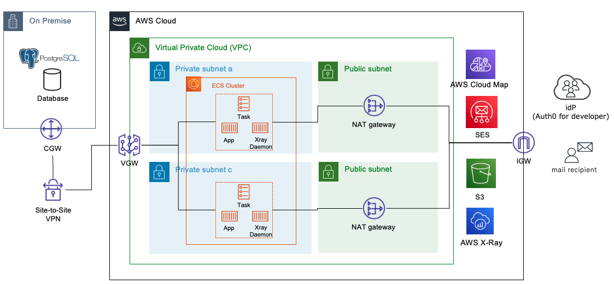

# Overview

* This system consists of two components: (1) user management and (2) a workflow that allows only pre-approved emails to be sent. 
* Each component is composed of microservices.
* The infrastructure for microservices is AWS ECS.
* Automatically configure each component in Cloudformation to run on AWS ECS.

# About

## Details of each microservice
- User-Management
	- Name : SimUsermanager
	- Role : Maintain user information, departments, and positions. In addition, registered information is automatically linked to Auth0 (idP).
	- Architecture: ASP.NET Core

- Workflow-front-end
	- Name : ApprovalSendmail
	- Role : Workflow for users and approvers of sending e-mails
	- Architecture : React

- Workflow-API-1
	- Name : SupervisorCheck
	- Role : Obtain your own supervisor's information when submitting an e-mail application. Retrieved from SimUsermanager.
	- Architecture : Golang

- Workflow-API-2
	- Name : ApplicationProcessing
	- Role : Application information (recipient, e-mail body, attached files, etc.) by users is stored in the DB. Update (approval or denial) of application information by approvers. The approved application information is linked to AWS SES.
	- Architecture : Golang

- Workflow-SendMail
	- Name : SESMailClient
	- Role : Send emails using AWS SES based on the sending information linked from ApplicationProcessing.
	- Architecture : node.js(express)

